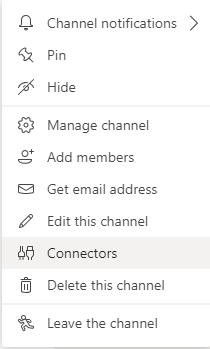
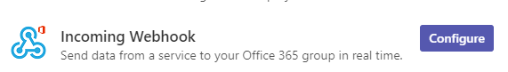
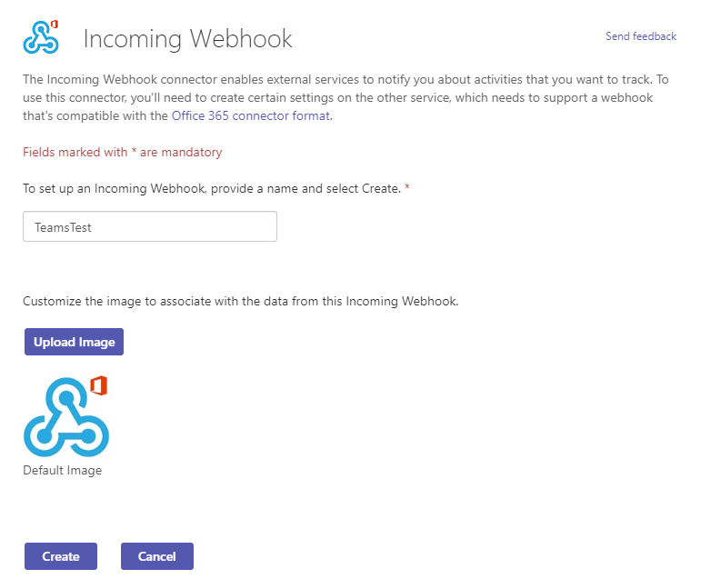
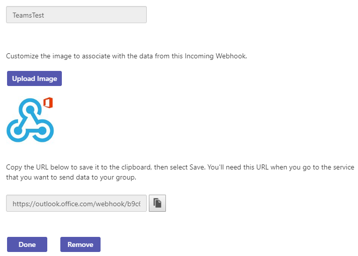

# TeamsWrapper
A wrapper to help you send a message to a Microsoft Teams Channel.

# To Use

- Go to your Microsoft Teams Channel, click on "Connectors" and configure an "Income Webwook";

---

---

---

---
- Get the channel URL and, at TeamsWrapper.Tests project, fill the environment variable "UrlTeamsChannel";

- Done. You can now send a message to the channel via this wrapper!

# Useful Links

[Microsoft Documentation](https://docs.microsoft.com/pt-br/microsoftteams/platform/webhooks-and-connectors/how-to/connectors-using)
